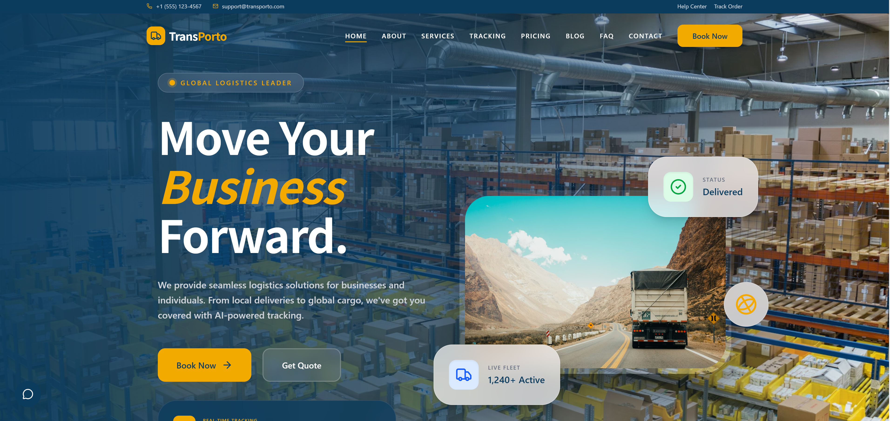

# 🚚 Transporto – Modern Transportation Website



🔗 **Live Demo:** https://transporto-umber.vercel.app/

---

## ✨ Overview

**Transporto** is a modern, fast, and fully responsive transportation website built with the latest frontend technologies. It is designed for logistics, cargo, taxi, and delivery services with a clean UI and conversion-focused layout.

The project showcases a **startup-level design**, smooth animations, and scalable architecture — ready for real-world deployment.

---

## 🚀 Features

* ⚡ Lightning-fast performance with Vite
* 📱 Fully responsive (Mobile, Tablet, Desktop)
* 🎨 Modern UI/UX design
* 🔍 Tracking system UI
* 📦 Service showcase sections
* 💳 Pricing plans layout
* 🧾 Contact form with validation
* 🎬 Smooth animations (Framer Motion)
* 🧩 Reusable React components
* 🧭 Clean routing with React Router
* 🌐 SEO-friendly structure

---

## 🛠️ Tech Stack

* **Frontend:** React (Vite)
* **Styling:** Tailwind CSS
* **Routing:** React Router DOM
* **Animations:** Framer Motion
* **Icons:** Lucide React

---

## 📂 Project Structure

```
/src
  /components     → Reusable UI components
  /pages          → All website pages
  /layouts        → Main layout (Navbar + Footer)
  /assets         → Images & static files
  /hooks          → Custom React hooks
  /utils          → Helper functions
  App.jsx
  main.jsx
```

---

## 📸 Preview

> Homepage UI Preview 👇


---

## ⚙️ Installation & Setup

Follow these steps to run the project locally:

```bash
# 1. Clone the repository
git clone https://github.com/mohakamran/transporto.git

# 2. Navigate to project folder
cd transporto

# 3. Install dependencies
npm install

# 4. Run development server
npm run dev
```

---

## 🧪 Build for Production

```bash
npm run build
```

---

## 🚀 Deployment (Vercel)

This project is fully optimized for **Vercel deployment**:

1. Push your project to GitHub
2. Go to Vercel
3. Import your repository
4. Click **Deploy**

Done 🎉

---

## 🎯 Pages Included

* Home
* About
* Services
* Tracking
* Pricing
* Contact
* Blog

---

## 💡 Highlights

* Clean and scalable architecture
* Pixel-perfect UI spacing
* Smooth animations and transitions
* Designed for real-world transportation businesses

---

## 🤝 Contributing

Contributions are welcome!

Feel free to fork this repo and submit a pull request.

---

## 📜 License

This project is open-source and available under the **MIT License**.

---

## 👨‍💻 Author

**Muhammad Kamran**
💼 Web Developer | Freelancer | E-commerce Expert

---

⭐ If you like this project, don’t forget to **star the repo!**
